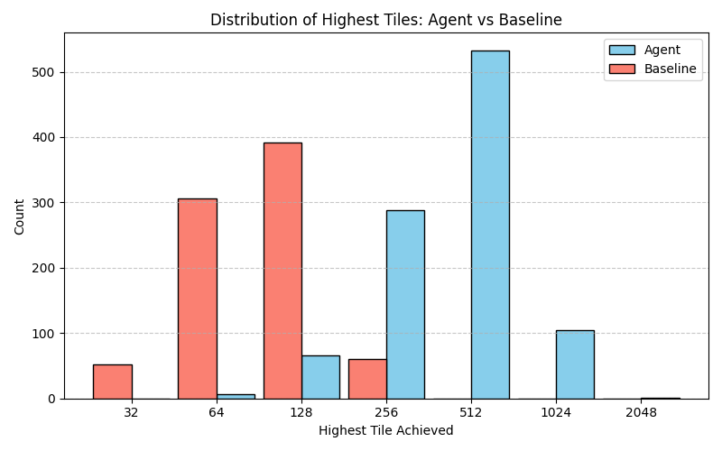
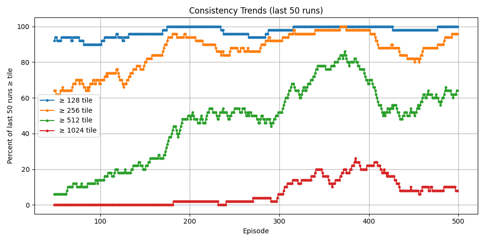
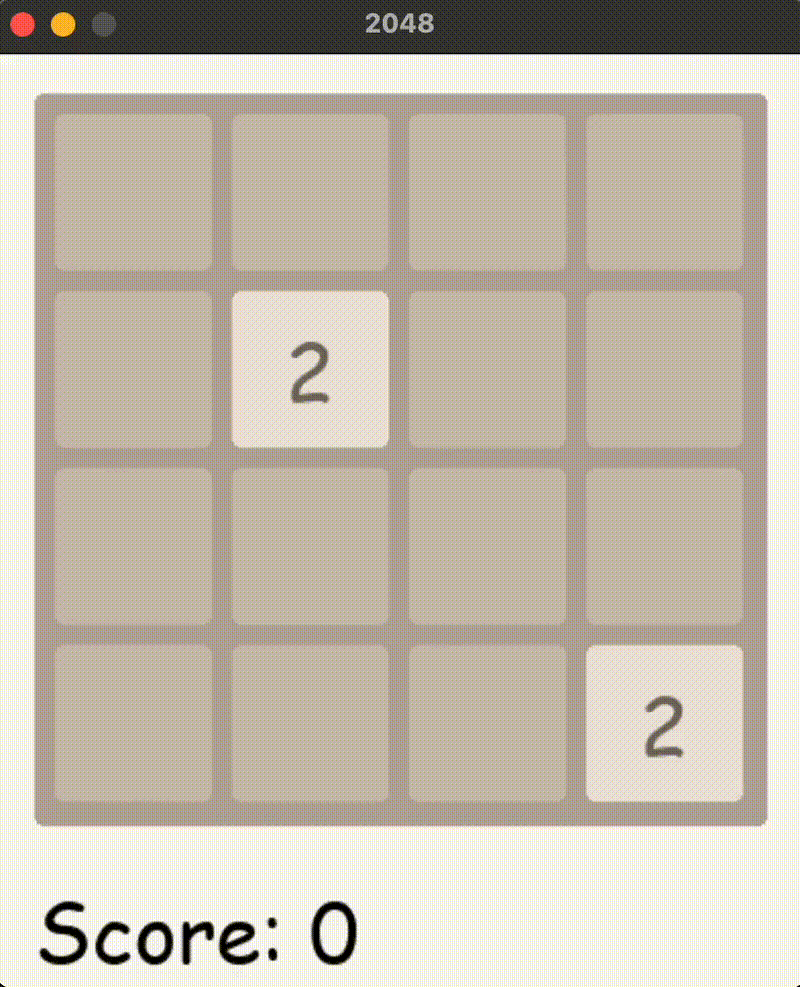
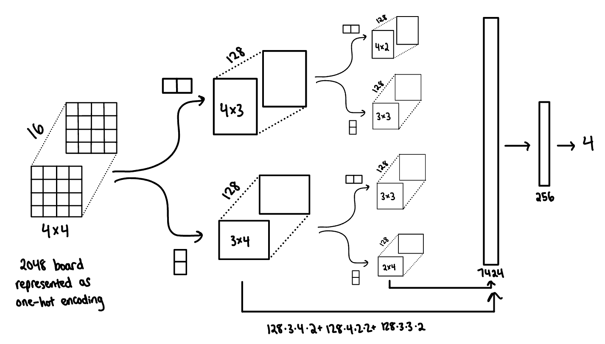

# 2048 Deep RL

Pytorch Convolutional Double DQN model to play 2048

## Highlights

From personal gameplay experience, I like to keep the high tile in the top left. It's a bad idea to
take the "down" action (usually detrimental when one is forced to "down"). By discouraging the "down" action, my goal is that the model makes progress faster.

Random actions (baseline) vs trained model (agent):



Model is able to consistently reach higher tiles (like 512) early in training: 



## Visualization



## Installation
Clone this repo and create a conda environment to keep package installs clean
```bash
conda create -n rl2048 python=3.12
conda activate rl2048
pip install -r requirements.txt
```
Deactivate conda environment
```bash
conda deactivate
```

## Usage
To watch model play 2048:
```bash
python3 play.py
```

To get a evaluate of model performance over many games
```bash
python3 plot.py
```

## Credits

Model by [https://github.com/bowass/2048-DQN-Agent/tree/main]

## License

[MIT](https://choosealicense.com/licenses/mit/)
